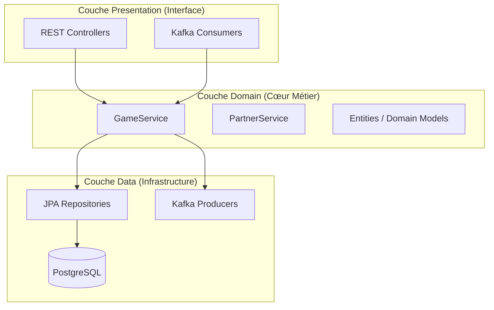
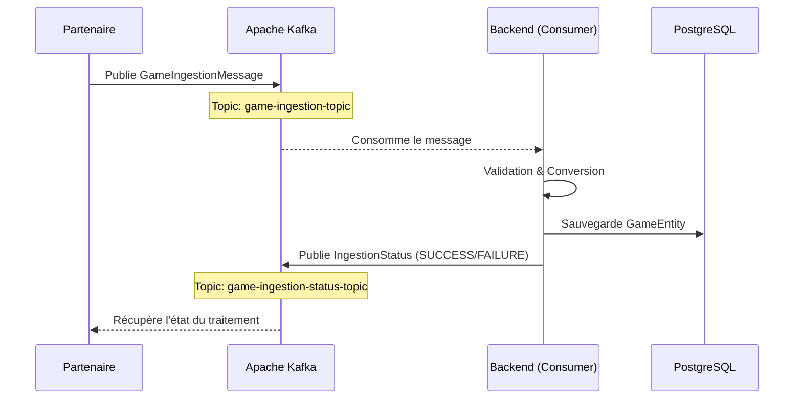
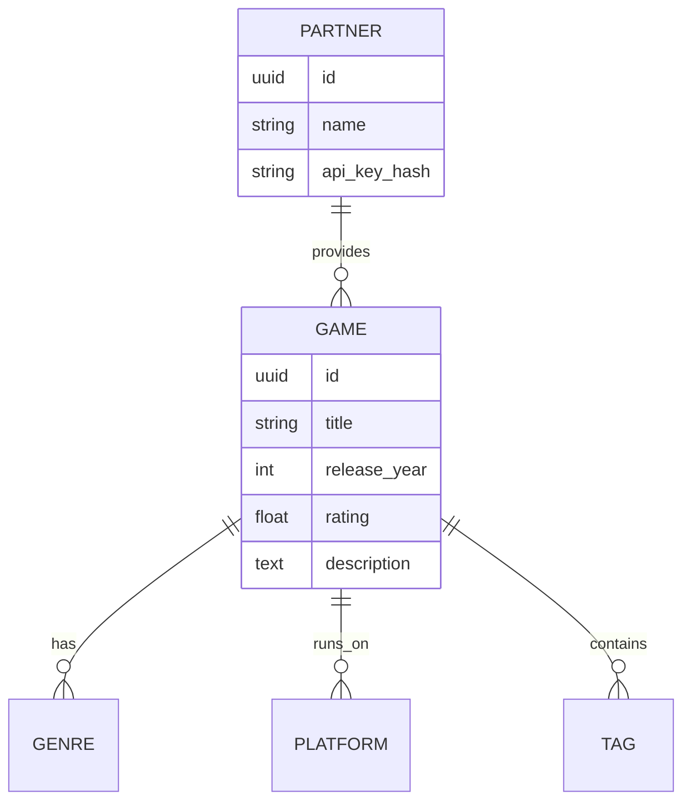

# Documentation Architecturale — GameSearch

Ce document détaille les choix de conception technique et l'organisation du code du projet GameSearch.

---

## 1. Architecture En Couches (N-Tiers) (Backend)

Le backend est structuré selon les principes de l'**Architecture En Couches (N-Tiers)** (ou Ports & Adapteurs). Cette approche garantit une isolation totale de la logique métier vis-à-vis des frameworks et des détails d'infrastructure.

### Schéma des Couches

- **Domain** : Contient les entités métier et la logique pure. Aucune dépendance vers Spring Web ou JPA.
- **Presentation** : Point d'entrée de l'application (HTTP, Événements Kafka).
- **Data (Infrastructure)** : Implémentation de la persistance et des sorties asynchrones.

---

## 2. Flux d'Ingestion Asynchrone (Kafka)

L'un des piliers technologiques du projet est l'utilisation d'un bus de messages pour la soumission asynchrone des catalogues de jeux.

### Avantages de cette architecture :
1. **Découplage** : Le partenaire n'attend pas la réponse de la base de données pour continuer.
2. **Robustesse** : Si le backend est temporairement indisponible, les messages sont stockés dans Kafka et traités ultérieurement.
3. **Scalabilité** : Plusieurs instances du Backend peuvent consommer le topic en parallèle pour augmenter le débit.

---

## 3. Modèle de Données

Le schéma relationnel est optimisé pour la recherche et le filtrage multicritères.

---

## 4. Conformité

La structure En Couches (N-Tiers) est vérifiée automatiquement à chaque build via des tests **ArchUnit**, garantissant qu'aucune violation de dépendance (ex: appel direct de la Database dans le Controller) ne soit introduite.
