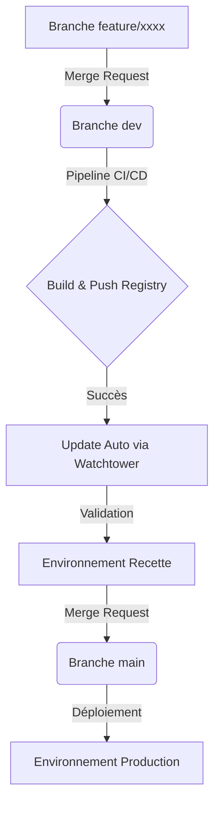

# Workflow de Développement - Projet GameSearch

Ce document décrit le cycle de vie du développement d'une fonctionnalité, de l'implémentation locale jusqu'au déploiement en production, en passant par l'environnement de recette.

## 1. Cycle de Développement

### Étape 1 : Développement Local (Feature Branch)
Tout nouveau développement doit s'effectuer dans une branche dédiée :
- **Nommage** : `feature/nom-de-la-feature` ou `fix/nom-du-bug`.
- **Action** : Le développeur travaille sur sa branche, effectue ses commits et valide son code localement.

### Étape 2 : Merge Request vers `dev` (Intégration)
Une fois la fonctionnalité terminée et testée localement :
- **Action** : Créer une **Merge Request (MR)** sur GitLab de la branche `feature/xxxx` vers la branche `dev`.
- **Validation** : Une revue de code est recommandée à cette étape.

### Étape 3 : Pipeline CI/CD (Audit & Build)
Le merge dans la branche `dev` déclenche automatiquement le pipeline GitLab CI :
- **Audit & Qualité** : Tests unitaires, couverture (80%), ArchUnit, et scans de sécurité (SAST).
- **Build & Push** : Si les tests passent, les images Docker (Backend & Frontend) sont construites et poussées sur le registre privé `registry.basteproductions.fr` avec le tag `dev-latest`.

## 2. Déploiement en Recette (Automatique)

L'environnement de **Recette** est configuré pour refléter l'état le plus récent de la branche `dev`.

- **Automatisation** : Le service **Watchtower** sur le serveur surveille le registre d'images. Dès qu'une nouvelle image `dev-latest` est détectée (suite au succès du pipeline sur `dev`), Watchtower redémarre automatiquement les conteneurs de recette avec la nouvelle version.
- **Accès Recette** : 
    - Application Web : [https://gamesearch-rec.basteproductions.fr](https://gamesearch-rec.basteproductions.fr)
    - API : [https://api.gamesearch-rec.basteproductions.fr](https://api.gamesearch-rec.basteproductions.fr)
- **Objectif** : Permettre une validation fonctionnelle dans un environnement identique à la production avant la mise en service réelle.

## 3. Mise en Production

Une fois la fonctionnalité validée en environnement de recette :

### Étape 4 : Merge Request vers `main` (Production)
- **Action** : Créer une **Merge Request** de la branche `dev` vers la branche `main`.
- **Déclenchement (Continuous Delivery)** : Le merge sur `main` ne déclenche aucun build d'image. Il active un job de promotion manuel sur le pipeline GitLab CI. Un responsable valide l'opération, ce qui injecte le tag `prod-latest` sur l'image qui a réussi la phase de Recette, validant le déploiement.
- **Accès Production** :
    - Application Web : [https://gamesearch.basteproductions.fr](https://gamesearch.basteproductions.fr)
    - API : [https://api.gamesearch.basteproductions.fr](https://api.gamesearch.basteproductions.fr)

## Résumé du Flux Git

## Rappels Importants
- **Qualité** : Un pipeline en échec sur `dev` bloque toute mise à jour de la recette.
- **Sécurité** : Les scans Trivy en fin de pipeline peuvent bloquer le push si des vulnérabilités HIGH/CRITICAL sont découvertes.
- **Immutabilité** : On ne reconstruit pas pour la production, on promeut ce qui a été testé en recette.
