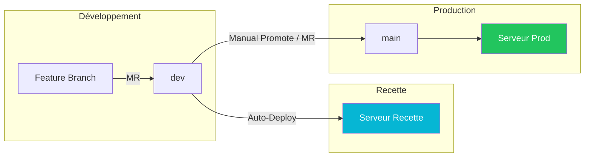
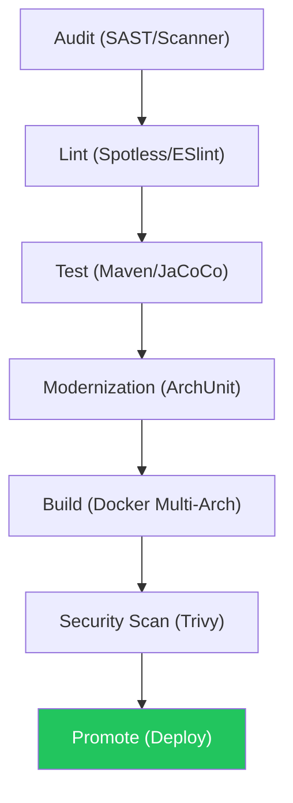

# 📽️ LA BIBLE DE SOUTENANCE - GameSearch (Dossier Final J-1)

Ce guide est conçu pour être suivi à la lettre. Si vous l'utilisez tel quel, votre présentation sera visuellement professionnelle et techniquement inattaquable.

---

## 🎨 PARTIE 1 : RÉGLAGES VISUELS GLOBAUX (DESIGN SYSTEM)
*Appliquez ces réglages à votre logiciel de présentation (PowerPoint, Canva, Marp).*

- **Fond (Background)** : Couleur unie `Slate 950` (`#020617`).
- **Marges (Safety Zone)** : Laissez un espace vide de **48px** (environ 2cm) sur tous les bords de chaque slide.
- **Police Titre** : **Inter - Extra Bold** (ou **Outfit**). Taille : **48px à 64px**.
- **Police Corps** : **Inter - Regular** (ou **Medium**). Taille : **24px**.
- **Couleurs de Texte** :
    - **Titres** : Blanc pur (`#FFFFFF`).
    - **Sous-titres / Descriptions** : Slate 300 (`#CBD5E1`).
    - **Mots Clés Importants** : Cyan (`#06B6D4`).
- **Composants Visuels** : Utilisez des icônes de la librairie **Lucide** ou **Heroicons** (couleur Cyan).

---

## 📽️ PARTIE 2 : BLUEPRINT SLIDE PAR SLIDE

### 🟦 SLIDE 0 : Titre & Introduction
**[Critère Prof : Identité & Équipe]**
- **Disposition** : Texte centré au milieu du slide.
- **Contenu** :
    - **Titre (64px)** : "GameSearch"
    - **Sous-titre (32px)** : "Industrialisation de l'Ingestion & Exploration de Jeux"
    - **Bas de page** : 
        - À gauche : Samuel Dorismond | Darlin | Ninon | Rodrigue
        - À droite : Soutenance de Projet S8 APC — EPITA
- **Design Tip** : Ajoutez une lueur Cyan diffuse (`#06B6D4`) derrière le mot "GameSearch". 
- **Script Oral** : 
> "Bonjour. Nous sommes ravis de vous présenter GameSearch. Notre projet ne s'arrête pas à un simple catalogue ; c'est une plateforme pensée comme un produit industriel, alliant robustesse, asynchronisme et automatisation totale."

---

### 📋 SLIDE 1 : Sommaire (Plan)
**[Critère Prof : Organisation du discours]**
- **Disposition** : Titre en haut à gauche. Liste numérotée centrée.
- **Espacement** : Laissez **40px** entre chaque point.
- **Contenu** :
    1. Vision & Problématique
    2. Architecture En Couches (N-Tiers) & Kafka
    3. Workflow Agile & Équipe
    4. La Forteresse CI/CD (Qualité & Sécurité)
    5. L'Usine de Livraison (Build & Déploiement)
    6. Démonstration Live
    7. Bilan & Perspectives
- **Script Oral** : 
> "Voici notre plan. Nous allons d'abord expliquer 'le pourquoi' du projet, avant de plonger dans le 'comment' avec notre cœur technique et notre pipeline de livraison continue."

---

### 🚀 SLIDE 2 : Vision & Problématique
**[Critère Prof : Contexte & Valeur Métier]**
- **Disposition** : Moitié gauche (Gris/Rouge) vs Moitié droite (Cyan/Blanc).
- **Contenu Gauche (Problème)** :
    - Éclatement des données (Raw Data).
    - Ingestion bloquante (Serveur qui sature lors d'imports massifs).
    - UX Lente.
- **Contenu Droite (Solution)** :
    - Centralisation unifiée.
    - **Ingestion Asynchrone** (Kafka).
    - Recherche multicritères instantanée.
- **Script Oral** : 
> "Le constat initial était simple : traiter des milliers de jeux en temps réel bloque les API classiques. Notre mission était de créer une solution qui sépare le flux d'ingestion partenaire de la navigation des joueurs, sans compromis sur la vitesse."

---

### 🏛️ SLIDE 3 : Architecture en Couches (N-Tiers)
**[Critère Prof : Architecture Modulaire & Clean Code]**
- **Disposition** : Schéma vertical ou en blocs empilés.
- **Points Clés** :
    - **Couche Présentation (REST)** : Gère l'exposition de l'API et les DTO.
    - **Couche Métier (Domain/Service)** : Contient toute la logique décisionnelle.
    - **Couche Accès aux Données (Persistence)** : Gère SQL via JPA/Hibernate.
- **Instruction Design** : Dessinez 3 blocs empilés. Des flèches indiquent que la communication ne va que du haut vers le bas.
- **Script Oral** : 
> "Côté technique, nous avons structuré notre Backend suivant une Architecture en Couches (N-Tiers) rigoureuse. Pourquoi ? Pour assurer une séparation nette des responsabilités. La présentation ne connaît pas les détails de la base de données, elle ne parle qu'à la couche métier. Cela rend le code stable et facile à tester."

---

### 🏛️ SLIDE 4 : La Puissance de Kafka (JUSTIFICATION)
**[Critère Prof : Justification technique majeure]**
- **Disposition** : Schéma horizontal Backend -> KAFKA (Grand cercle Violet) -> Consumer.
- **Arguments (En gros, au centre)** :
    - **Découplage Brut** : Le client reçoit '202 Accepted' immédiatement.
    - **Résilience** : Kafka stocke les messages même si le worker tombe.
    - **Backpressure** : Le système s'adapte à la vitesse d'écriture en base.
- **Script Oral (Attention, ici le prof écoute)** : 
> "Expliquons le cœur de notre ingestion : Apache Kafka. Pourquoi Kafka plutôt qu'une simple API ? Pour l'asynchronisme. Un partenaire peut nous envoyer 50 000 jeux ; notre API accepte le flux instantanément, Kafka le stocke, et notre worker le traite au rythme idéal pour la base de données. C'est l'assurance d'un service qui ne sature jamais."

---

### 🛡️ SLIDE 5 : La Forteresse CI/CD (Partie 1)
**[Critère Prof : Assurance Qualité & Automatisation]**
- **Disposition** : Liste de 3 blocs haut de gamme avec icônes Cyan.
- **Détails Techniques** :
    - **Audit Automatique** : SAST & Secret Detection (GitLab).
    - **Modernization (ArchUnit)** : Blocage si les règles de séparation des couches sont violées.
    - **Tests Qualitatifs** : 91 tests unitaires, JaCoCo ≥ 70%.
- **Script Oral** : 
> "La qualité n'est pas une option. Notre pipeline bloque systématiquement tout code qui ne respecte pas nos standards. Nous avons intégré ArchUnit qui 'casse' le build si un développeur tente de contourner les règles de notre architecture en couches. C'est la police de la qualité."

---

### 🚀 SLIDE 6 : L'Usine de Livraison (Partie 2)
**[Critère Prof : Multi-arch, Sécurité Container & Promotion]**
- **Disposition** : Circuit de flux de gauche à droite.
- **Éléments visuels** : Logo Docker + Logo Trivy (🛡️).
- **Points Clés** :
    - **Docker Multi-Arch** : Build pour amd64 (Intel) et arm64 (Cloud/Mac).
    - **Scan Trivy** : Recherche de CVE (Garantie 0 Critical CVE).
    - **Promotion d'Image** : On ne re-build jamais, on retag l'image validée.
- **Script Oral** : 
> "Une fois le code validé, nous construisons une image Docker multi-architectures. Avant de déployer, Trivy scanne l'image pour s'assurer qu'aucune bibliothèque n'est piratée. Enfin, la promotion d'artefacts garantit que l'image testée en recette est EXACTEMENT celle déployée en production."

---

### 🕹️ SLIDE 7 : Démonstration Live
- **Détails Chronométrés** :
    - 0-30s : Recherche et filtres sur le frontend (Fluidité).
    - 30-60s : Connexion Admin et Ingestion Kafka (Puissance).
    - 60-90s : Preuve visuelle du statut (PENDING -> SUCCESS).
- **Script Oral** : 
> "Passons à la démo. Regardez cette recherche fluide. Maintenant, je déclenche un import lourd via Kafka. On voit le monitoring en direct changer de statut. C'est simple, c'est efficace, c'est asynchrone."

---

### 🏁 SLIDE 8 : Bilan & Perspectives
- **Bilan** : Projet complet, pipeline industrielle, architecture en couches rigoureuse.
- **Futur** : Monitoring Grafana Avancé, Passage Cluster Kubernetes (K8s).
- **Script Oral** : 
> "En conclusion, GameSearch est une plateforme robuste. Nous sommes fiers d'avoir implémenté des standards industriels comme Kafka KRaft et une CI/CD de bout en bout. Nous sommes prêts pour vos questions."

---

## 📈 3. Schémas de Référence (À intégrer dans vos slides)

### Schéma A : Git Flow

### Schéma B : La Pipeline CI/CD (7 Étapes)

---

## 💡 4. Réponses aux Questions Prévues (Aide-mémoire)

1. **"Pourquoi Kafka ?"** : "Pour absorber les pics de charge et assurer le découplage asynchrone sans ralentir l'utilisateur final."
2. **"Pourquoi une architecture en couches ?"** : "Pour garantir une séparation stricte des responsabilités. Cela simplifie la maintenance et permet de tester chaque couche (Présentation, Métier, Données) de façon isolée."
3. **"Pourquoi Docker Multi-Arch ?"** : "Pour être compatible nativement avec tous les types de serveurs Cloud modernes (ARM64) et classiques (AMD64) sans perte de performance."
